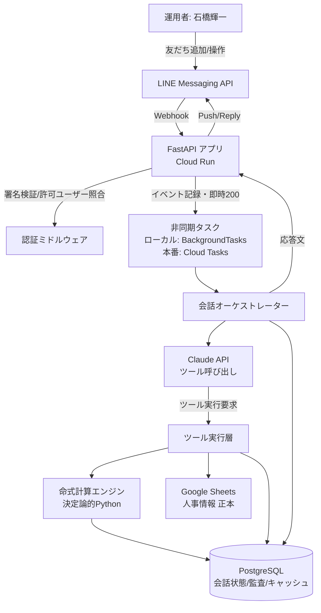
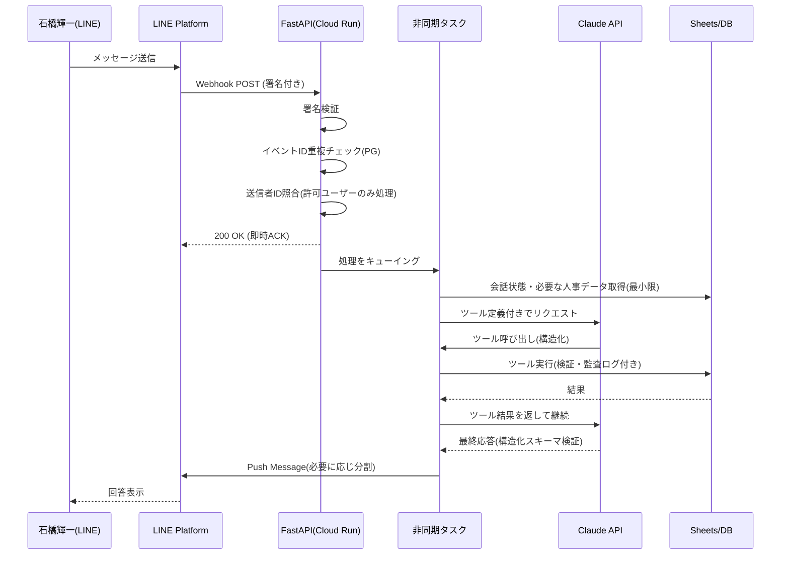
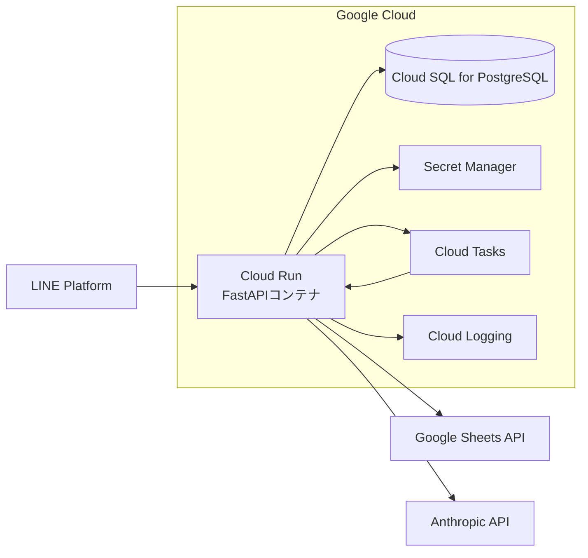

# システムアーキテクチャ設計 — 黒革の手帳

## 1. 全体構成図



## 2. コンポーネント責務

| コンポーネント | 責務 |
|---|---|
| FastAPI アプリ | Webhook受信、署名検証、許可ユーザー照合、即時ACK、ルーティング |
| 認証ミドルウェア | LINE署名検証、`ALLOWED_LINE_USER_ID`照合、未許可応答の一元化 |
| 非同期タスク層 | 命式計算・Claude呼び出し・シート書き込みなど時間のかかる処理をWebhook応答後に実行 |
| 会話オーケストレーター | 会話状態（登録途中・確認待ち等）の管理、Claudeへのツール提供、応答整形、LINE分割送信 |
| Claude API層 | 質問意図理解、ツール呼び出し指示、命式データと人事データの統合解釈、構造化出力（Pydantic検証） |
| ツール実行層 | Claudeが呼び出す各ツールの実処理。権限・入力検証・冪等性・監査ログを担保してからSheets/DB/計算エンジンを呼ぶ |
| 命式計算エンジン | 四柱推命・算命学の決定論的計算。LLMを一切介さない純粋関数群 |
| Google Sheets連携 | 人事情報の正本。抽象化されたリポジトリインターフェースの実装（本番/モック切替可能） |
| PostgreSQL | 会話状態、一時登録データ、確認待ち操作、変更履歴、取り消し情報、論理削除、Webhookイベント処理履歴、命式計算キャッシュ、AIリクエストメタデータ、エラー記録 |

## 3. レイヤー構成（コード上のディレクトリ）

```
app/
  main.py            FastAPI エントリポイント
  config.py          環境変数・CalculationPolicy等の設定
  auth/               LINE署名検証・許可ユーザー照合
  line/               Webhookハンドラ、リッチメニュー、メッセージ分割送信
  calculation/         四柱推命・算命学の決定論的計算エンジン
  sheets/              Google Sheetsリポジトリ（本番/モック）
  db/                  SQLAlchemyモデル・リポジトリ
  ai/                  Claudeツール定義・オーケストレーター・プロンプト設計
  services/            人物登録/更新/取り消し/面談記録などアプリケーションサービス
  schemas/             Pydanticスキーマ（入出力・構造化出力検証）
tests/                 pytest テスト一式
golden_tests/          ゴールデンテストデータ・CLI
alembic/               DBマイグレーション
scripts/               リッチメニュー登録、初期データ投入等の運用スクリプト
assets/                 リッチメニュー画像生成
```

## 4. Webhook処理フロー



## 5. 命式計算の内部構成

```mermaid
flowchart LR
    IN[生年月日時・出生地・性別] --> POLICY[CalculationPolicy設定]
    POLICY --> ENGINE1[四柱推命エンジン<br/>年月日時柱/日干/五行/通変星/十二運/蔵干]
    POLICY --> ENGINE2[算命学エンジン<br/>中心星/十大主星/十二大従星/天中殺/守護神/位相法]
    ENGINE1 --> LUCK1[大運/年運/月運(四柱推命側)]
    ENGINE2 --> LUCK2[大運(算命学側)]
    ENGINE1 --> OUT[構造化結果<br/>FourPillarsResult]
    ENGINE2 --> OUT2[構造化結果<br/>SanmeigakuResult]
    OUT --> CACHE[(PostgreSQL計算キャッシュ)]
    OUT2 --> CACHE
```

四柱推命側と算命学側は明確に独立したモジュールとし、結果を上書きしない。両方の結果、計算ルールバージョン、計算日時、入力データ、出生時間有無、精度注意を`CalculationResult`にまとめて保持する。

## 6. データ責務分離

- **Googleスプレッドシート（正本）**: 人物基本情報、所属・役職、人事評価、面談記録、希望キャリア、機微情報タグ付きデータ。
- **PostgreSQL**: LINE会話状態、登録途中の一時データ、確認待ち操作、操作履歴・変更前後、LINE入力原文、取り消し情報、論理削除情報、Webhookイベント処理履歴、命式計算キャッシュ、AIリクエストメタデータ、エラー記録。

人物の紐付けは氏名でなく内部`person_id`（UUID）を使用する。Sheets側にも`person_id`列を追加し、既存列は変更しない（詳細は`docs/current-sheet-schema.md`）。

## 7. 非同期処理方針

- ローカル/開発: FastAPIの`BackgroundTasks`＋PostgreSQLベースの簡易ジョブテーブルでキューを模倣（外部ブローカー不要）。
- 本番: Cloud Tasksを用い、Webhook受信後にHTTPタスクをエンキューし、別エンドポイント（またはCloud Run Jobs）が処理する。インターフェース（`TaskQueue`抽象クラス）は共通化し、実装のみ差し替える。

## 8. 権限・検証の一元化

書き込み系ツール（register_person, prepare_person_update, confirm_person_update, append_interview_note, soft_delete_record, undo_last_change）は、Claudeが直接実行するのではなく、ツール実行層で以下を必ず検証してからサービス層を呼ぶ。

1. LINEユーザーIDが許可済みか
2. 操作権限（唯一の利用者なので実質は認証と同義だが将来の多ユーザー化に備え分離）
3. 対象人物の存在・一意特定
4. 必須項目・データ型
5. 確認が必要な操作は確認フラグの有無
6. 重複登録の可能性
7. 監査ログへの記録
8. 冪等性（同一`idempotency_key`の二重実行防止）

## 9. デプロイ構成（本番）



## 10. 技術選定と理由

| 技術 | 理由 |
|---|---|
| Python 3.12+ / FastAPI | 非同期I/O対応、Pydanticとの親和性、Cloud Runとの相性 |
| SQLAlchemy 2.x + Alembic | 型安全なORMとマイグレーション管理 |
| line-bot-sdk (v3系, linebot.v3) | LINE公式Python SDK。2026年時点でv3系が現行、v2系はレガシー扱い（`docs/line-setup.md`参照） |
| anthropic (公式Python SDK) | Claude APIの公式クライアント。モデル名は`ANTHROPIC_MODEL`環境変数で指定しコードに固定しない |
| Google Sheets API v4 | 人事情報正本との連携。抽象化して本番/モックを切替 |
| Docker/Docker Compose | ローカルでPostgreSQL含め一括起動 |
| Cloud Run + Cloud SQL + Secret Manager | サーバーレスで低運用コスト、石橋輝一1名利用という小規模要件に適合 |

## 11. 第2段階・第3段階への拡張性

相性分析・複数人比較・チーム編成用のツール（`compare_people`, `analyze_team`）はインターフェースをMVPから定義し、実装は第2段階で追加する。データモデル（`CompatibilityResult`, `TeamComposition`等のスキーマ）も雛形として`app/schemas/phase2.py`に用意する。
